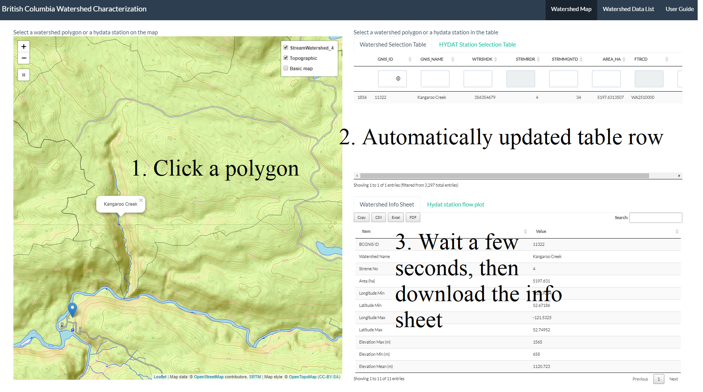
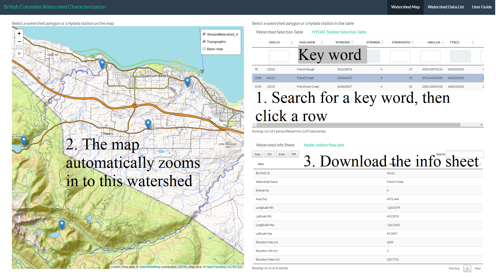
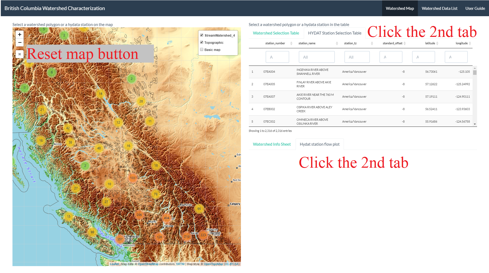
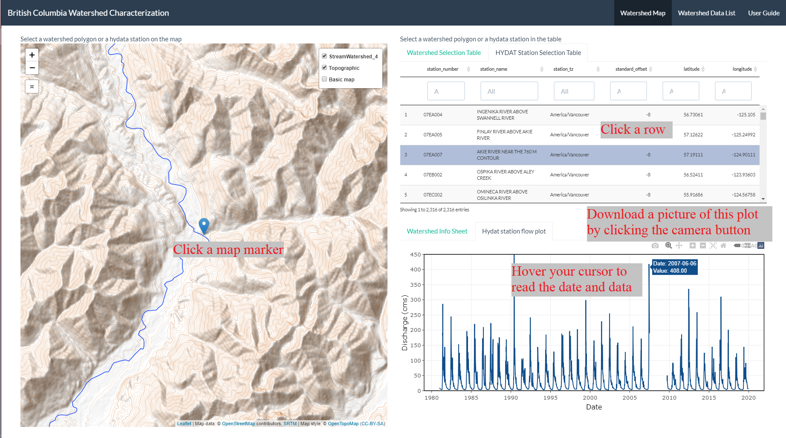

<style>
    body .main-container {
        max-width: 1500px;
    }
    .list-group-item.active, .list-group-item.active:focus, .list-group-item.active:hover {
    background-color: #38598a;
}
</style>

```{r setup, include=FALSE}
knitr::opts_chunk$set(echo = TRUE)
```

# How to use this application
## Introduction  
This application is designed to present the new version of **BC Watershed Characterization Report** on page 2, and provide an interactive way to select watersheds and hydrometric stations on page 1 from both a map and a list table. Users can use this application:

  + **Search for the watershed of interest** Search for a keyword (e.g. nearby river) in the watershed table, click the result row, then see the watershed on the zoomed-in map.  
  + **Locate the Watershed of interest** Zoom in to the location of a watershed, click the polygon to see its name, and read a watershed info sheet in the result section.  
  + **Search for the hydrometric data from a HYDAT station** Search the keyword of a nearby river in the HYDAT table, then see the map zooms in to the station. In the result section, see data in an interactive plot.
  + **Locate the HYDAT station** Zoom in to the HYDAT station and click the map marker, then see the data in an interactive plot.  
    
  

Figure 1 Application initialized 


## Select watershed of interest and get the result info sheet
  
There are 2 ways to select your interested watershed. Using both ways will result in a downloadable watershed info sheet.  
  
  + **Map**  On the map, zoom in to your location (use the mouse stroller or click the "+" on the map), then click the polygon, check the popped-out watershed name. After the click, on the upright side of the map, the `Watershed Selection Table` will be automatically filtered to the exact row. After a few seconds, the downright page (*tab: Watershed Info Sheet*) will show a watershed info sheet. Use the buttons `Copy`, csv`, `Excel`, `PDF` to save the info sheet.
    
    
Figure 2 Select a watershed on the map
  + **Table** In the table, search your interested watershed by any keyword (e.g. river's name, ID), click the row, then the map will be automatically zoomed in to the watershed that you just selected. After a few seconds, the downright page (*tab: Watershed Info Sheet*) will show a watershed info sheet. Use the buttons `Copy`, csv`, `Excel`, `PDF` to save this info sheet.  
  
    
Figure 3 Select a watershed in the table
  
     

## Select HYDAT station and get hydrometric data plot  

There are also 2 ways to select a HYDAT station. Using both ways will result in a hydrometric data plot. Users need to manually activate the second tab for the HYDAT station list and the data plot.  

Figure 4 Active HYDAT station part
  
  + **Map** The map was set by default to show the entire lower mainland of BC, so zoom in to your interested location, then click the marker on the map to select a HYDAT station. Then the upright table will be filtered to the selected station. Or,
  
  + **Table** Search for a keyword, then click the row in the result. The map will be automatically zoomed in to your selected station.  
    
  + **Interactive result plot** Hover your cursor on the plot to read the value and date, or use the camera button to download this image.
  
  Figure 5 Select a HYDAT station and read the hydrometric data plot
  
  
# Data source
 
## Hydrology stations  
Canada wide [HAYDAT stations](https://www.canada.ca/en/environment-climate-change/services/water-overview/quantity/monitoring/survey/data-products-services/national-archive-hydat.html), filled by `PROV_TERR_STATE_LOC=="BC"`, got **2316 BC stations**.    
R package: [fasstr](https://bcgov.github.io/fasstr)  
R package: [tidyhydat](https://github.com/ropensci/tidyhydat)  
  
## Polygon Data  
**WHSE_BASEMAPPING.FWA_WATERSHEDS_POLY**  
Download: https://cat.data.gov.bc.ca/dataset/freshwater-atlas-watersheds/resource/a05f805b-3a60-4dac-8481-9590486883d6  
`FWNMDWTRSH_polygon.shp`, filled by `STRMRDR == 4`, got **3297 watershed polygons**.
  


  
